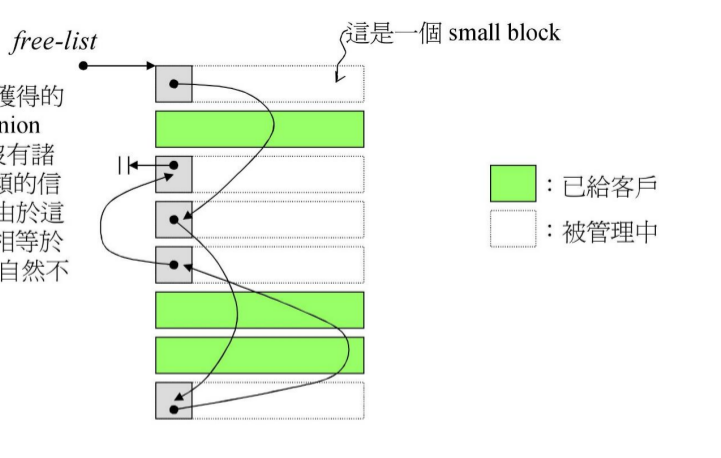

# pool allocator内存行为图解

## 环境准备

在侯捷的《STL源码剖析》一书中2.9版本STL标准库中的分配器是采用pool allocator作为标准的内存分配器，但是后面（不知道从哪一版本开始）的STL开始讲new_allocator作为标准分配器了，pool allocator被放置在\__gnu_cxx命名空间中。pool allocator所在的位置是ext/pool_allocator.h，但是注意当我们看ext/pool_allocator.h头文件内容的时候发现有一部分函数的在头文件中只给出了声明，没有给出具体的实现，比如一下这几个函数：

```c++
      _GLIBCXX_CONST _Obj* volatile*
      _M_get_free_list(size_t __bytes) throw ();
    
      __mutex&
      _M_get_mutex() throw ();

      // Returns an object of size __n, and optionally adds to size __n
      // free list.
      void*
      _M_refill(size_t __n);
      
      // Allocates a chunk for nobjs of size size.  nobjs may be reduced
      // if it is inconvenient to allocate the requested number.
      char*
      _M_allocate_chunk(size_t __n, int& __nobjs);
```

查找资料发现这部分函数的具体实现是在gcc的源码仓库中即gcc/libstdc++-v3/src/c++98/pool_allocator.cc，当系统安装gcc的时候会有一个动态库叫做libstdc++.so.6，这个动态库中就有这些函数的实现。为了方便学习，我从releases/gcc-5.4.0版本的gcc代码中拷贝了这部分代码到[src目录](../../src/pool_allocator.cc)中，然后在编译的时候将pool_allocator.cc编译进libstl.so动态库中，用户程序先链接libstl.so，然后才链接系统的libstdc++.so.6，所以上面那些函数就会优先使用libstl.so动态库中的定义。为了证明我们使用了自己目录下的pool_allocator.cc，我们在代码中做了一个打印操作。编译demo运行如下命令：

```bash
./build/test/test.bin --gtest_filter=TestStdAllocator.test_usr_defined_pool_allocator
```

运行完我们可以看到如下log，证明程序已经成功调用libstl.so中的pool_allocator.cc代码。

```bash
[==========] Running 1 test from 1 test suite.
[----------] Global test environment set-up.
[----------] 1 test from TestStdAllocator
[ RUN      ] TestStdAllocator.test_usr_defined_pool_allocator
WARNING: Logging before InitGoogleLogging() is written to STDERR
I0410 22:23:26.953526  1368 gtest_main.cpp:8] testsuite name is TestStdAllocator test case name is test_usr_defined_pool_allocator
I0410 22:23:26.953661  1368 pool_allocator.cc:68] use usr defined pool malloc
I0410 22:23:26.953686  1368 pool_allocator.cc:68] use usr defined pool malloc
[       OK ] TestStdAllocator.test_usr_defined_pool_allocator (0 ms)
[----------] 1 test from TestStdAllocator (0 ms total)

[----------] Global test environment tear-down
[==========] 1 test from 1 test suite ran. (0 ms total)
[  PASSED  ] 1 test.
```

## pool allocator的分配行为

### 几个重要的属性

1、如果全局指定直接使用new来分配内存，则在pool allocator中会直接调用::operator new函数进行内存分配，没有内存池的管理。

可以运行如下命令，可以看到一旦设置了GLIBCXX_FORCE_NEW环境变量之后，pool allocator会直接使用operator new来进行内存分配

```bash
GLIBCXX_FORCE_NEW=true ./build/test/test.bin --gtest_filter=TestStdAllocator.pool_allocator_use_new_operator
```

2、如果对象需要的内存块大小超过128个字节的话也会直接调用::operator new来进行分配内存，因为分配大块内存的话其实malloc的额外内存开销比较小。

3、如果需要分配内存的大小在8字节和128字节之间的话，则会使用内存池管理内存。

对于2、3两点我们可以通过运行一下命令来验证：

```bash
./build/test/test.bin --gtest_filter=TestStdAllocator.test_pool_allocator
```

### 几个重要的变量

1、pool alloc分配的内存是严格的进行内存对齐的，对齐的大小是8字节，即最小内存是8字节，那如果我们通过内存池想申请char和int类型的内存块，pool_alloc只能给我们8字节大小的内存块，但其实我们实际只使用1byte和4bytes大小的内存，这就会有一定的内部碎片产生，这个是无法避免的。

2、pool_alloc是通过16个链表来管理不同大小的内存块的，从8字节到128字节。这些个链表在_S_free_list中。

3、内存池的归根结底还是需要调用::operator new向系统heap中申请内存，每次会申请一大块的内存，然后将这一大块内存分给对应的free_list，当然也不会全部分完，这个时候就需要我们还要管理直接从系统heap申请来的内存，指针\_S_start\_free对应的空余内存池开始的位置，_s_end_free则对应的是内存结束的位置，而\_S_heap_size则统计着向系统申请内存的总和。

4、定义了_Obj这个union的结构体，和前面提到的embedded pointer是类似的，他主要的作用就是将空闲的内存块串联起来，方便后续使用，类似下面图的功能




```c++
      enum { _S_align = 8 }; // 内存池分出去最小的内存是8字节
      enum { _S_max_bytes = 128 }; // 内存池分出去最大的内存是128字节
      // 从8,16，24到128需要16个free_list来进行管理
      enum { _S_free_list_size = (size_t)_S_max_bytes / (size_t)_S_align };

      union _Obj
      {
        union _Obj* _M_free_list_link;
        char        _M_client_data[1];    // The client sees this.
      };

      static _Obj* volatile         _S_free_list[_S_free_list_size];

      // Chunk allocation state.
      static char*                  _S_start_free; // 内存池开始的位置
      static char*                  _S_end_free;  // 内存池结束的位置
      static size_t                 _S_heap_size;  // 统计使用了heap的总和
```